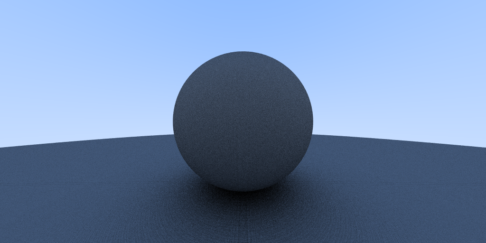

# Ray Tracing

A simple ray tracer with support for environment map illumination and multiple types of materials (diffuse, metallic, dieletric). The code is based on the <a href="https://raytracing.github.io/">book series</a> by Peter Shirley.

